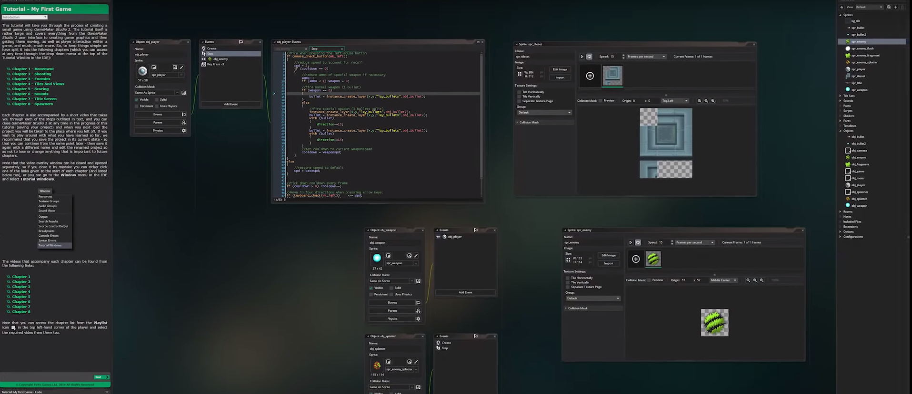

# Entry-02-changing topic
 
 

After hearing suggestions from classmate about Unity,I've deicide to change my topic from C# to Unity.

Knowing that using Unity isn't a Must,I've spend the majority of the week on learning Unity.

 
<h3>Why Unity?</h3>

Unity is a game engine that can be used to create three-dimensional and two-dimensional games,I want to make a game that can be playable and at the same time looking good.

<h3>Where to start?</h3>

So.....Unity awesome.....nice...but where are I suppose to learn all this? I google unity beginner tutorial,search on youtube and I found a channel call Brackeys and its'title is just <strong>How to make a Video Game in Unity</strong>

<h1>Takeaways!</h1>
<ol>
  <li> <strong>Always</strong> and I mean <strong>Always Google</strong>,you will never know what you will find.I was looking at some post and I've found a link about Unity physics,which is something I should look at after finish watching some of the video</li>
  <li>Always look deeper when you are exploring something,I didn't know C# was not a must for unity,so I've waste some time on C# rather than learning about Unity.</li>
</ol>

link I will look back this week: 

https://unity3d.com/learn/tutorials/s/physics