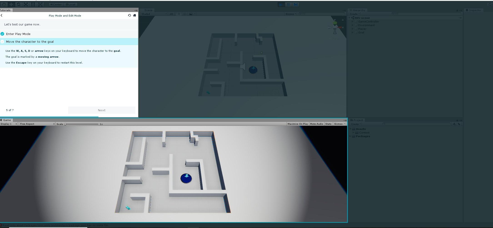
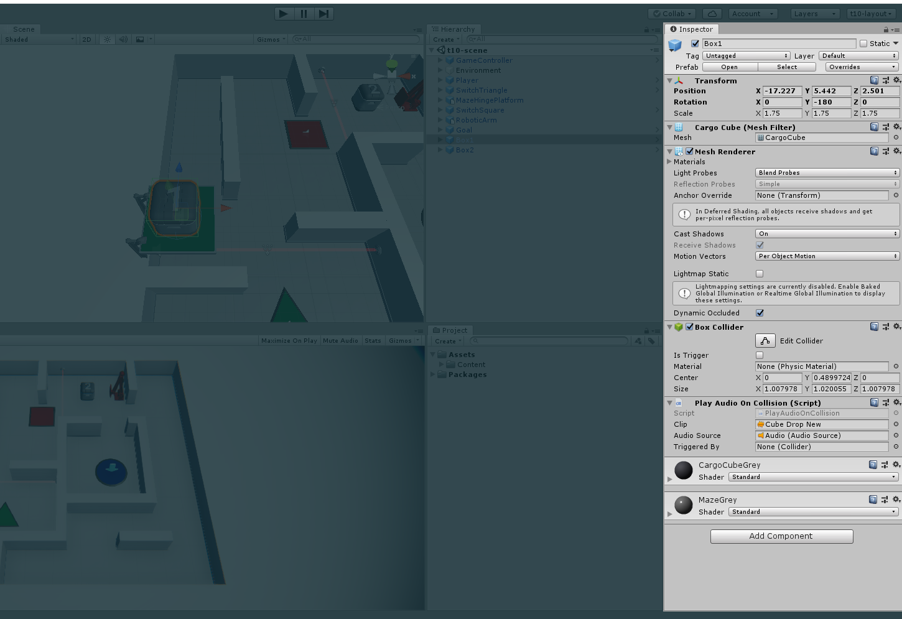

# Entry-03-learning the fundamentals of Unity
 

Ugh.....so what did I do this week?I watch video on Youtube about Unity...then what?

<h4>I've learn all of these awesome things from the video,now what?</h4>

For this week I focus a lot on the motion of the object and the physics,to do this I've tinker with the tutorial inside of Unity 

 
<h3>What's what in Unity?</h3>

Unity is a game engine that can be used to create three-dimensional and two-dimensional games,here we have the Scene view at the top,it's like the controller in the MVC.We can arrange object the thing we want

Next is the game view where we see what the player see while they "play".

<h3>What about the "phyiscs"?</h3>

Here we can see the inspector window,you can edit the 'physics' of the object,the mass,the grravity...making it more realistic.

The Hierarchy window show us everything in the scene view,just a list for us to keep track what object should be in the view.

<h1>Takeaways</h1>
<ol>
  <li> <strong>Always</strong> try out something you've learn,I try out what I've learn and I realize,I wasn't doing something right...so always try things out don't just be like "I've watch this,I'm fine..."</li>
  <li>Have notes for the things we've learn everyday,the reason is we will most likely to forget if we don't have some sort of notes to remind ourselves the little "a-ha" moment.</li>
  
</ol>

<h1>Plan for this week</h1>
<ol>
  <li> Finish up the tutorial and decide what I will make for my independent study.</li>
 
</ol>

<h1>Things I've learn this week</h1>
<ol>
  <li>change how object behave(physically)</li>
  <li>How to select object in the scene view and Hierarchy window</li>
  <li>using inspector window to add componets to object</li>
</ol>
