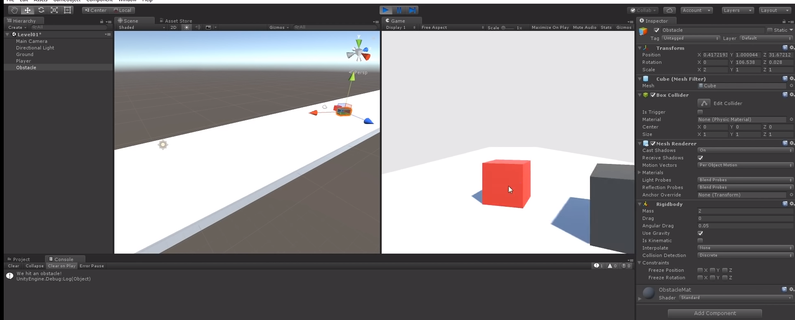

# Entry-04-deciding on my end product
 

So what did I do last week for my independent study? I've been thinking about my end product, so I can start tinkering with the things I will be needing to use and knowing what are some possible things I need to learn in order to reach my end product.

<h4>I've been thinking about a game that involves a lot of physics,and has its own uniqueness</h4>

<h4>For this week I focus a lot on the idea of my end product.</h4>
<ol>
  <li>decide what object I will use and how will they behave before and after collision</li>
  <li>what type of game am I making</li>
  <li>what are the controls for the object that is making the collision</li>
</ol>

 
<h3>So....what's the plan for my end product?</h3>

<h5>I was thinking of something that is "doable" and at the same time a bit unique.</h5>
<h5>I was going back and forth and one idea kept coming back into my mind, and that was a bowling game</h5>

<h3>A bowling game... Yea? What makes my version unique?</h3>

Normally, when we are playing bowling we throw the ball out and we are aiming to knock down those 10 pin. 

I was thinking what if I change it so that there are two types of pin one that will increase your score(white) and one that will make you lose instantly(black),which instead of you hitting the pin, you will be dodging the pin.

<h3>An important part of the game is knowing if two objects had a collision,in my case that would be the bowling ball and the pin, know how to check whether or not if two object have touch will be a big steps closer to my end product.</h3>

Here you can see after the red block had a collision with the black block, the console knows that we've hit an obstacle, I know It's possible to check for one object, <strong>BUT</strong> I need to check for <strong>ALL</strong> pins, and that would be inefficient.

<h1>Takeaways</h1>
<ol>
  <li><strong>Sometimes you just have to figure things out.</strong>There are so many solution out there to solve my problem, but sometimes there's none.Knowing what I want to do and what micro steps I need to take to overcome my problem.</li>
  
</ol>

<h1>Plan for this week</h1>
<ol>
  <li>Learn more about collision,since as the motion after the collision</li>
  <li> Find out whether or not if there is a better of checking the object had a collision with the bowling ball</li>
 
</ol>

