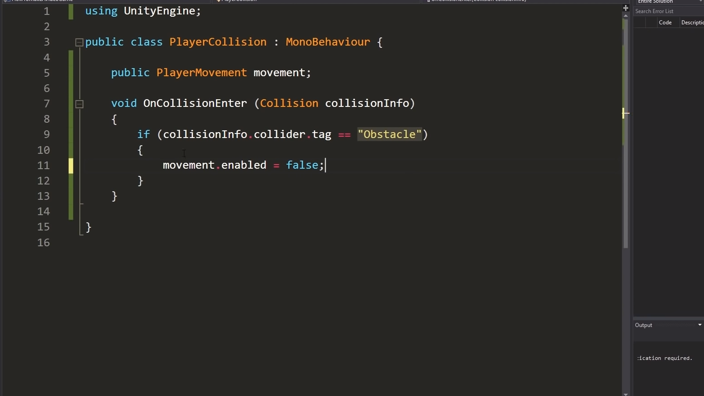
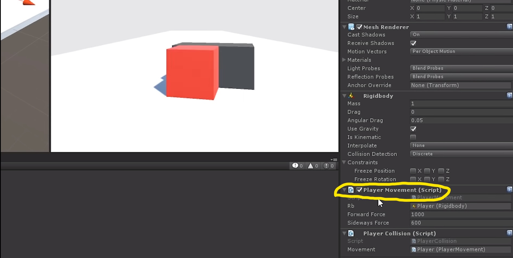
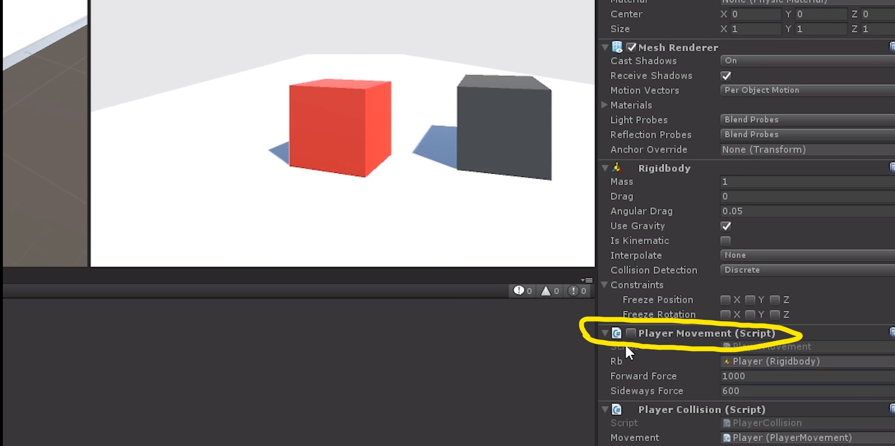

# Entry-05-Collision
 

So what did I do last week for my independent study? I've been working toward my end product, so I've continue my work work from last week, finding if there is a better way for my to check the 
object had a collision with the bowling ball, the answer is <strong>Yes, Unity can check whetheror not if objects had a collision with the bowling ball,in fact they check for ALL collision.</strong>
 Which means even if I drop the ball to the floor, Unity <strong>will</strong> count that as a collision.

<h4>I've been thinking a way to overcome this, which indeed took my some times(after countless hours of tinkering and googleing).</h4>

<h5>For this week I focus a lot on the collision part for my end product.</h5>

<h3>So.... what progress did I make this week?</h3>

<h5>I was thinking over the week, a way to overcome the "checking whetheror not if objects had a collision with the bowling ball" issue</h5>
<h5>I was thinking what about showing all the collision, <strong>BUT</strong> with object ID!</h5>
<h5>Ex:We have a collision with (Redblock)</h5>

<h3>Yea? Show all the collision with the object ID,BUT how am I going to do it?</h3>

Normally, when we are Googling about something, that takes about less than a min if the question was common then maybe less than 10 sec. But for my obstacle, I would have to tinker with the code and solving the puzzle piece by piece.

I was thinking what if I add a placeholder to the object so that every time the object had any collision with other object , the code will run and shows the object had a collision with so an so object.Above is the code that took me a long time to figure out, basiclly when the object had a collision with an object , it will gets it ID and stop moving

Here you can see after the red block had a collision with the black block, the check goes away that means the red block will stop moving, which means I've figure out a solution for my issue.

<h1>Takeaways</h1>
<ol>
  <li><strong>Making lots ofsmall steps is better than making a big step</strong>Sometimes google doesn't get the answer for you directly, but It can be use as a stepping stone for my goal.</li>
  
</ol>

