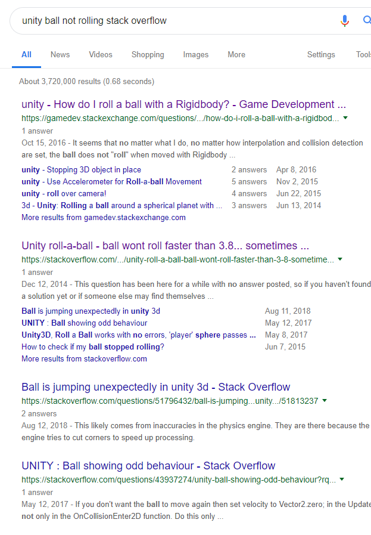

# Entry-07-Putting it all together
<br>

Picking up from last week, I've been working on the rolling part from last week, because It was not rolling the way I wanted.

```
using UnityEngine;
using UnityEngine.UI;
using System.Collections;

public class rolling : MonoBehaviour
{

    private Rigidbody rb;
    public float speed;


    void start()
    {

        rb = GetComponent<Rigidbody>();

    }


    void fixedUpdate()
    {

        float moveHorizontal = Input.GetAxis("Horizontal");
        float moveVertical = Input.GetAxis("Vertical");

        Vector3 movement = new Vector3(moveHorizontal, 0.0f, moveVertical);

        rb.AddForce(movement * speed);


    }

}
```

<h4>I've been thinking of ways I could debug this, I've tried to ask my partner Ahmad to check the code I've typed in, checking StackOverflow,and even checking on youtube.</h4>
 

<h3>Eventually, I've found a video about rolling a ball, when I'm comparing the code I have and the one they have. It looks like I'm missing a few parts of the code, so when I add those parts back, the ball is <strong>NOT EVEN MOVING</strong></h3>


<h5>So after A LOT of tinker,googling and asking help from my partner Ahmad,it turns out, <strong>I DIDN'T SET THE SPEED.</strong></h5>
<h5>When the speed is 0, no matther what button I press,it will not start moving.</h5>


<video width="500" height="300" controls>
  <source src="ballrolling.mp4" type="video/mp4">
</video>


<p>when I change the speed, now it should look sometimes like this.</p>


<h1>Next step</h1>
<ol>
  <li>putting everything together,adding the score and other obstacle and the ball all together</li>
  <li>improve the layout of the obstacle</li>
</ol>

<h1>Takeaways</h1>
<ol>
  <li> Patience is the key to success,"Be patient and tough - someday this pain will be useful to you." after solving fixing another thing, my code wasn't working because I set my speed to 0, but I didn't realize until I look over the all of my code and the work I did, and patiently overcoming this.</li>
  
</ol>


